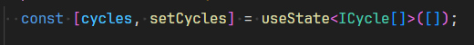
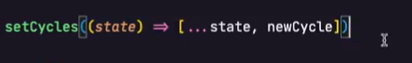

# Iniciando um novo ciclo

**Nota:** Apesar de a aolicação rodar apenas 1 ciclo de cada vez, para que seja possível identificar cada ciclo e registrar em log, será necessário que exista um ID. Será necessário criar um estado (useState) para armazenar o ciclo, definindo um formato de cada ciclo através de uma interface.

#### Exemplo de interface de ciclo:

```typescript
interface ICycle {
  id: string;
  task: string;
  minutesAmount: number;
}
```

Ao criar o estado é importante que seja iniciado com uma informação do mesmo tipo da aplicação.



Função de criação do ciclo:

OBS: toda vez que um estado fro alterado, e a alteração depender da versão anterior e recomendado que ele seja setado em formato de função


