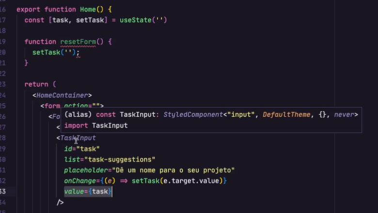
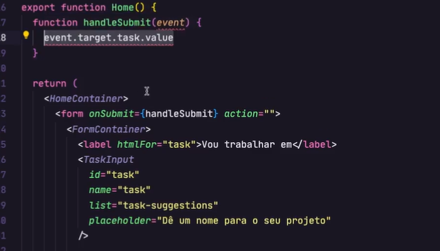
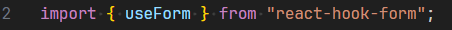

# Trabalhando com formulários no projeto

Existem várias formas de criar formulários no React. Há dois modelos principais de trabalho: **controlled** e **uncontrolled**.

---

## Controlled Components

Em componentes controlados, o valor dos inputs é mantido em tempo real dentro de uma variável de **estado** (geralmente com `useState`). Toda vez que o usuário digita ou altera o valor de um input, o evento dispara uma atualização do estado, garantindo que o React tenha sempre a informação atualizada.

Ou seja: o valor exibido no input depende diretamente do valor que está no estado.



### Vantagens:

- Permite maior controle sobre os dados do formulário.
- Fácil de validar os dados enquanto o usuário digita.
- Mais previsível, pois o React é a única fonte da verdade dos dados.
- Facilita a execução de ações baseadas no valor do input (ex.: habilitar botão apenas se o campo estiver preenchido).

### Desvantagens:

- Pode ter uma pequena perda de performance em formulários muito grandes, pois cada digitação gera uma re-renderização.

---

## Uncontrolled Components

Em componentes não controlados, o React **não** controla diretamente o valor do input. Em vez disso, o valor é lido diretamente do DOM, geralmente usando uma **ref** (`useRef`) para acessar o valor apenas quando necessário (ex.: no submit do formulário).

Aqui, o input gerencia seu próprio estado interno.

```tsx
const inputRef = useRef<HTMLInputElement>(null);

function handleSubmit() {
  console.log(inputRef.current?.value);
}
```



###

Vantagens:

- Pode ser mais performático para formulários grandes, pois evita re-renderizações constantes.
- Código mais simples em alguns casos de uso onde o valor do input só é necessário no final (ex.: apenas no submit).

### Desvantagens:

- Menos controle sobre o fluxo de dados.
- Mais difícil fazer validações em tempo real.
- Pode ser mais difícil sincronizar a UI com o estado do aplicativo.

---

### Quando usar?

| Cenário                                  | Melhor opção |
| ---------------------------------------- | ------------ |
| Validação em tempo real, inputs pequenos | Controlled   |
| Formulário grande, leitura só no submit  | Uncontrolled |

## Dica importante:

- Para formulários simples ou quando precisa validar enquanto o usuário digita → **Controlled** é geralmente a melhor escolha.
- Para formulários muito grandes ou que apenas precisam ler o valor no final → **Uncontrolled** pode ser mais eficiente.

## Uso da biblioteca reack-hook-form

Essa biblioteca pode trabalhar de maneira Controlled e Uncontrolled trasando o melhor dos doiso mundos sem perder a fluides da interatividade, sendo uma biblioteca simples de utiizar.

```cmd
npm i react-hook-form
```

Importação da biblioteca:



O useForme é um objeto que pode ser utilizado no componente na qual sera uttilizado, ele retorna funções
